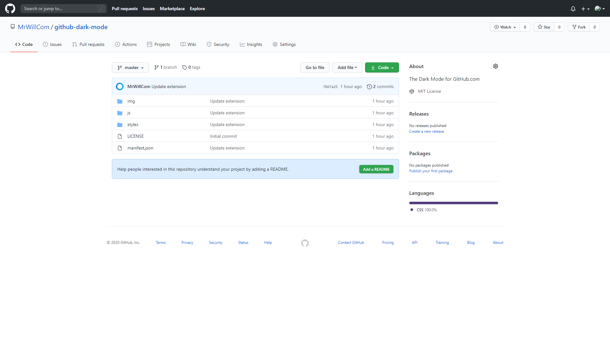
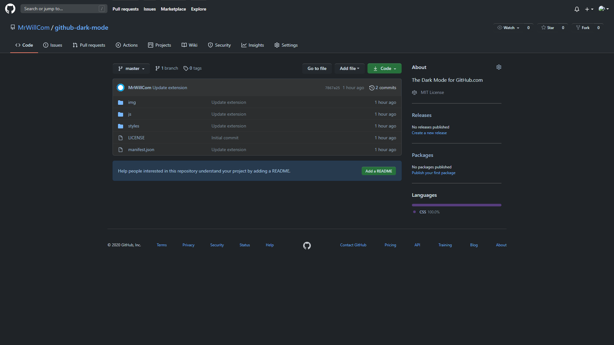

# GitHub Dark Mode for Safari

 

The Dark Mode for GitHub.com, now for Safari!

**This is the Safari port of [Mr Will's Project](https://github.com/MrWillCom/github-dark-mode).**

## Preview (Screenshots are from the original project)

**Before:**

**After:**

## Installation

You can get the ZIP file from the [release page](https://github.com/aeilot/github-dark-mode-safari/releases). Unarchive and place it in the `/Applications` folder.

> Downloading from Mac APP Store is currently not available.

## Contributing

Contributing is always welcomed! You can add localizations and features to the project, or just simply submit an issue!

**For the JS/CSS Development, please contribute to [MrWillCom/github-dark-mode](https://github.com/MrWillCom/github-dark-mode).**

## References / Thanks

Big thanks to the authors of the [original project](https://github.com/MrWillCom/github-dark-mode) for Chrome and Firefox: 
- Mr Will 
  - [Blog](https://mrwillcom.github.io) 
  - [GitHub](https://github.com/MrWillCom).
